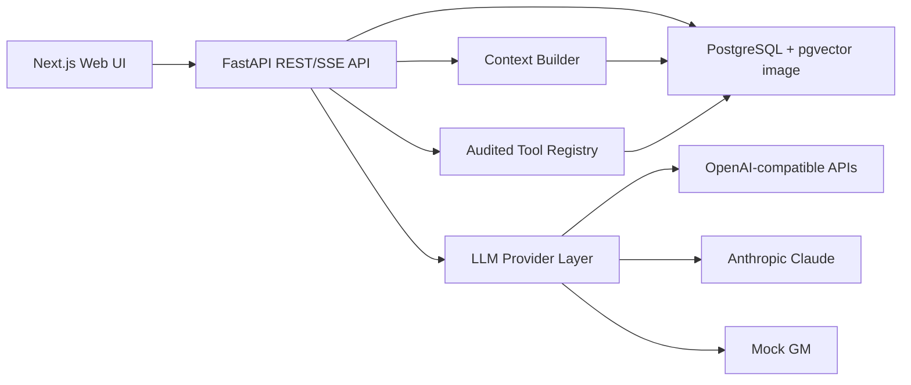

# TTRPG GM Engine

Self-hostable, system-agnostic AI gamemaster engine for long-running D&D, DSA and homebrew TTRPG campaigns.

This is not just a chatbot. The backend exposes audited tools for dice, ruleset checks, campaign state, characters, NPC memory, quests, lore import and combat state. The GM layer builds compact context before every LLM call and persists messages, events and state changes.

## Current MVP

Current version: `0.1.0`.

The project uses [Semantic Versioning](https://semver.org/):

- `MAJOR` for incompatible API, schema or campaign data changes.
- `MINOR` for backward-compatible features.
- `PATCH` for backward-compatible fixes.

- Docker Compose stack: FastAPI backend, Next.js frontend, PostgreSQL with pgvector image, Redis.
- Campaigns, sessions, characters, NPCs, quests, messages, lore chunks, dice rolls, combats and tool-call audit tables.
- Built-in ruleset profiles:
  - `dnd5e`: d20-compatible mechanics shape, no protected adventure/content database.
  - `dsa5`: 3W20-compatible mechanics shape, no protected official content lists.
  - `custom`: editable first-class homebrew profile.
- LLM provider abstraction:
  - `mock` demo mode without API key.
  - OpenAI-compatible `/chat/completions` endpoints.
  - Anthropic Claude API.
- Tool registry with JSON schemas and audit logging.
- Context builder with token-budget sections and secret-field stripping for player-facing context.
- Lore importer for Markdown, JSON and YAML with prompt-injection warning detection.
- Web UI for chat, character overview, NPC/quest views and ruleset overview.
- Tests for dice parsing, ruleset checks, importer safety and tool audit behavior.

## Architecture



Key principle: rules are data-driven. D&D and DSA are example profiles; homebrew rulesets are first-class.

## Quick Start

Prerequisites on Linux:

- Docker Engine
- Docker Compose v2 (`docker compose`)

```bash
cp .env.example .env
docker compose up --build
```

Open:

- Frontend: [http://localhost:3000](http://localhost:3000)
- Backend health: [http://localhost:8000/api/health](http://localhost:8000/api/health)
- API docs: [http://localhost:8000/docs](http://localhost:8000/docs)

Load the demo campaign from the UI or call:

```bash
curl -X POST http://localhost:8000/api/seed
```

## LLM Setup

Default `.env.example` uses:

```env
DEMO_MODE=true
DEFAULT_LLM_PROVIDER=mock
DEFAULT_MODEL=mock-gm
```

For OpenAI-compatible APIs:

```env
DEFAULT_LLM_PROVIDER=openai-compatible
DEFAULT_MODEL=gpt-4.1-mini
OPENAI_API_KEY=sk-...
OPENAI_BASE_URL=https://api.openai.com/v1
```

For local providers:

```env
DEFAULT_LLM_PROVIDER=openai-compatible
DEFAULT_MODEL=llama3.1
OPENAI_API_KEY=local-not-used
OPENAI_BASE_URL=http://host.docker.internal:11434/v1
```

For Claude:

```env
DEFAULT_LLM_PROVIDER=anthropic
DEFAULT_MODEL=claude-3-5-sonnet-latest
ANTHROPIC_API_KEY=sk-ant-...
```

API keys stay on the backend.

## Backend Development

```bash
cd backend
python -m venv .venv
source .venv/bin/activate
pip install -e ".[dev]"
export DATABASE_URL="sqlite:///./dev.db"
alembic upgrade head
python scripts_seed.py
uvicorn app.main:app --reload
```

Run tests:

```bash
cd backend
pytest
```

## Frontend Development

```bash
cd frontend
npm install
npm run dev
```

## Data Model

The schema includes the requested MVP and extension surfaces:

- Identity and access: `users`, `campaign_members`
- Campaign engine: `campaigns`, `sessions`, `messages`, `timeline_events`, `world_facts`
- Characters: `characters`, `character_logs`, `inventories`, `relationships`
- World: `npcs`, `npc_memories`, `locations`, `factions`, `secrets`, `visibility_scopes`
- Quests and clues: `quests`, `quest_steps`, `clues`
- Rules: `rulesets`, `ruleset_versions`, `ruleset_change_log`, campaign `house_rules`, character `ruleset_data`
- Combat: `combats`, `combatants`
- RAG/import: `lore_documents`, `lore_chunks`
- Audit and operations: `tool_call_logs`, `llm_requests`, `pending_changes`, `settings`

Most mutable domain payloads use JSON-compatible structured data so rulesets and homebrew fields can evolve without hardcoding D&D into the database.

## Tool Layer

The backend exposes tool definitions at:

```text
GET /api/tools
POST /api/tools/run
```

Implemented MVP tools include:

- `roll_dice`
- `get_campaign_state`
- `update_campaign_state`
- `create_timeline_event`
- `get_character`
- `update_character`
- `update_character_inventory`
- `search_npcs`
- `create_npc`
- `add_npc_memory`
- `search_lore`
- `create_quest`
- `update_quest`
- `start_combat`
- `advance_combat_turn`
- `get_combat_state`
- `create_pending_change_for_review`
- `get_ruleset`
- `perform_ruleset_check`
- `calculate_derived_values`
- `validate_character_against_ruleset`

Every tool call writes `tool_call_logs` with provider, model, input, output, status and affected entities.

## Import Format

Lore import endpoint:

```text
POST /api/lore/import
```

Supports Markdown/text, JSON and YAML. Uploaded text is treated as untrusted data. Suspicious prompt-injection phrases are stored as warnings in document metadata and must not be followed as instructions.

Examples are in `examples/`:

- `character.dnd5e.json`
- `npc.alrik.json`
- `quest.old_mill.json`
- `village.greifendorf.yaml`
- `custom_ruleset.2d10.json`

## Backup and Restore

Backup:

```bash
docker compose exec db pg_dump -U gm gm > backup.sql
```

Restore into a fresh database:

```bash
cat backup.sql | docker compose exec -T db psql -U gm gm
```

For campaign-level exports, use the JSON API surfaces as they are expanded. The schema is designed so campaign-owned rows can be exported by `campaign_id`.

## Reverse Proxy

Expose only the frontend publicly when possible. Proxy examples:

- Frontend: `http://frontend:3000`
- Backend API: `http://backend:8000`

Set:

```env
NEXT_PUBLIC_API_URL=https://your-api.example.com
CORS_ORIGINS=https://your-frontend.example.com
```

## Security Notes

- API keys are backend-only.
- Imported lore is untrusted data.
- Tool calls are validated and audited.
- The MVP includes rate limiting, CORS config and campaign-scoped data models.
- Production deployments should replace the default `SECRET_KEY`, use HTTPS and tighten DB credentials.
- Auth models exist; full login/role enforcement is a Phase 1 hardening task after the base engine.

## Licensing and Content

This project does not bundle official adventures, monster books, proprietary setting text or protected rulebook content. Built-in rulesets describe mechanics shape and UI terms only. Users are responsible for rights to uploaded/imported material. SRD-compatible content can be imported with appropriate attribution.

## Roadmap

### Phase 1: MVP

- Login and role enforcement.
- Campaign creation UI.
- Character creation UI.
- Chat with LLM and persisted messages.
- Dice tool.
- Basic NPC/location database.
- Session logs.
- Docker Compose.

### Phase 2: Persistent Campaign Engine

- Timeline UI.
- Quest and inventory editors.
- NPC memory views.
- Full tool-calling execution loop.
- Session summaries and entity summaries.

### Phase 3: RAG/Lore

- Embeddings and pgvector search.
- Markdown/JSON/YAML importer UI.
- Source attribution.
- Visibility-filtered lore retrieval.

### Phase 4: Combat Mode

- Initiative roller.
- Combatant editor.
- HP/status updates.
- Round log and combat UI.

### Phase 5: Multi-User

- Group mode.
- Live SSE/WebSocket updates.
- Character-specific knowledge.
- Player/GM/admin roles.

### Phase 6: Advanced GM

- Faction simulation.
- World time and consequence scheduler.
- Random encounter modules.
- NPC voice/style modules.
- Optional maps, scenes and TTS.

## Troubleshooting

- Backend cannot connect to DB: wait for `db` healthcheck, then rerun `docker compose up`.
- Frontend cannot reach API: verify `NEXT_PUBLIC_API_URL` and `CORS_ORIGINS`.
- No LLM response: use `DEFAULT_LLM_PROVIDER=mock` first, then configure provider keys.
- Local Ollama from Docker: use `host.docker.internal` as host on Docker Desktop.
- Migration issues: run `docker compose logs backend` and confirm `DATABASE_URL`.
