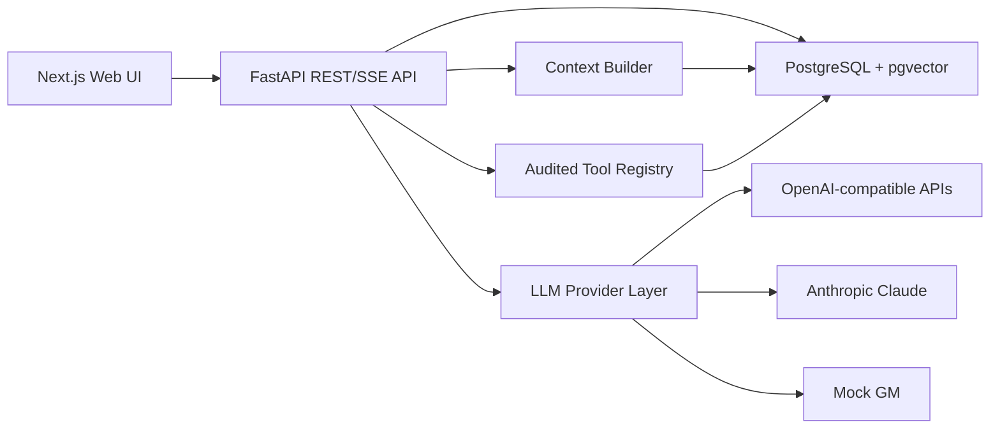

# TTRPG GM Engine

Self-hostable, system-agnostic AI game master for long-running D&D, DSA and homebrew TTRPG campaigns.

The backend gives the GM audited tools for dice, rules checks, campaign state, characters, NPC memory, quests, lore and combat. Before every LLM call it builds a compact context from the campaign data, and afterwards it stores messages, events and state changes.

Version `0.1.0` · [Changelog](CHANGELOG.md) · [Contributing](CONTRIBUTING.md) · [MIT License](LICENSE)

## Features

- **Rulesets as data:** built-in profiles `dnd5e` (d20), `dsa5` (3W20) and `custom` (editable homebrew). Homebrew rulesets are first-class.
- **LLM providers:** `mock` demo mode that works without an API key, any OpenAI-compatible `/chat/completions` endpoint, and Anthropic Claude.
- **Tool registry:** tools described as JSON Schema, every call written to an audit log.
- **Context builder:** token budget per context section; secret fields are stripped from player-facing context.
- **Lore import:** Markdown, JSON and YAML, with prompt-injection warnings.
- **Campaign data:** campaigns, sessions, characters, NPCs, quests, messages, lore chunks, dice rolls and combats.
- **Web UI:** chat, character overview, NPC and quest views, ruleset overview.
- **Tests:** dice parser, ruleset checks, importer safety, tool audit.

## Architecture



Rules are data: D&D and DSA ship as example profiles, and homebrew rulesets use the same mechanism.

The Docker Compose stack runs four services:

| Service    | Source                   | Host port         |
| ---------- | ------------------------ | ----------------- |
| `frontend` | `./frontend` (Next.js)   | `FRONTEND_PORT`   |
| `backend`  | `./backend` (FastAPI)    | `BACKEND_PORT`    |
| `db`       | `pgvector/pgvector:pg16` | `POSTGRES_PORT`   |
| `redis`    | `redis:7-alpine`         | internal, reserved for later use |

## Quick Start

Requires Docker Engine with Docker Compose v2.

```bash
cp .env.example .env
docker compose up --build
```

On start, the backend applies the database migrations and installs the built-in rulesets.

| URL | Purpose |
| --- | ------- |
| [http://localhost:3000](http://localhost:3000) | Web UI |
| [http://localhost:8000/api/health](http://localhost:8000/api/health) | Health check |
| [http://localhost:8000/docs](http://localhost:8000/docs) | API docs (OpenAPI) |

Load the demo campaign with **Demo laden** in the web UI or via the API:

```bash
curl -X POST http://localhost:8000/api/seed
```

The GM starts in `mock` mode. To connect a real model, see [LLM providers](#llm-providers).

## Configuration

All settings live in `.env`. The template is `.env.example`.

| Variable | Default | Purpose |
| -------- | ------- | ------- |
| `POSTGRES_DB`, `POSTGRES_USER`, `POSTGRES_PASSWORD` | `gm`, `gm`, `change-me` | Database credentials |
| `POSTGRES_PORT`, `BACKEND_PORT`, `FRONTEND_PORT` | `5432`, `8000`, `3000` | Published host ports |
| `NEXT_PUBLIC_API_URL` | `http://localhost:8000` | Backend URL as the browser reaches it |
| `CORS_ORIGINS` | `http://localhost:3000` | Allowed frontend origins, comma-separated |
| `SECRET_KEY` | placeholder | Long random value for production |
| `DEMO_MODE` | `true` | Reserved for later use |
| `DEFAULT_LLM_PROVIDER` | `mock` | `mock`, `openai-compatible` or `anthropic` |
| `DEFAULT_MODEL` | `mock-gm` | Model name for the provider |
| `OPENAI_API_KEY`, `OPENAI_BASE_URL` | empty, `https://api.openai.com/v1` | OpenAI-compatible provider |
| `ANTHROPIC_API_KEY` | empty | Anthropic provider |
| `REQUEST_TIMEOUT_SECONDS` | `60` | Timeout for OpenAI-compatible requests |

### LLM providers

API keys are read by the backend only.

OpenAI:

```env
DEFAULT_LLM_PROVIDER=openai-compatible
DEFAULT_MODEL=gpt-4.1-mini
OPENAI_API_KEY=sk-...
OPENAI_BASE_URL=https://api.openai.com/v1
```

Local OpenAI-compatible server, for example Ollama:

```env
DEFAULT_LLM_PROVIDER=openai-compatible
DEFAULT_MODEL=llama3.1
OPENAI_API_KEY=local-not-used
OPENAI_BASE_URL=http://host.docker.internal:11434/v1
```

Docker Desktop resolves `host.docker.internal` automatically. With Docker Engine on Linux, add this to the `backend` service in `docker-compose.yml`:

```yaml
extra_hosts:
  - "host.docker.internal:host-gateway"
```

Anthropic Claude:

```env
DEFAULT_LLM_PROVIDER=anthropic
DEFAULT_MODEL=claude-sonnet-5-5
ANTHROPIC_API_KEY=sk-ant-...
```

## Development

Requires Python 3.11+ and Node.js 20.

Backend with SQLite:

```bash
cd backend
python -m venv .venv
source .venv/bin/activate
pip install -e ".[dev]"
export DATABASE_URL="sqlite:///./dev.db"
alembic upgrade head
python scripts_seed.py
uvicorn app.main:app --reload
```

Backend tests:

```bash
cd backend
pytest
```

Frontend:

```bash
cd frontend
npm install
npm run dev
```

## Reference

### Data model

The schema already covers the planned extensions:

| Area | Tables |
| ---- | ------ |
| Identity and access | `users`, `campaign_members` |
| Campaign engine | `campaigns`, `sessions`, `messages`, `timeline_events`, `world_facts` |
| Characters | `characters`, `character_logs`, `inventories`, `relationships` |
| World | `npcs`, `npc_memories`, `locations`, `factions`, `secrets`, `visibility_scopes` |
| Quests and clues | `quests`, `quest_steps`, `clues` |
| Rules | `rulesets`, `ruleset_versions`, `ruleset_change_log`, campaign `house_rules`, character `ruleset_data` |
| Combat | `combats`, `combatants` |
| Lore import | `lore_documents`, `lore_chunks` |
| Audit and operations | `tool_call_logs`, `llm_requests`, `pending_changes`, `settings` |

Mutable domain payloads are stored as JSON, so rulesets and homebrew fields evolve independently of the database schema.

### Tools

```text
GET  /api/tools       list tool definitions
POST /api/tools/run   run a tool
```

| Area | Tools |
| ---- | ----- |
| Dice | `roll_dice` |
| Campaign | `get_campaign_state`, `update_campaign_state`, `create_timeline_event` |
| Characters | `get_character`, `update_character`, `update_character_inventory` |
| NPCs | `search_npcs`, `create_npc`, `add_npc_memory` |
| Lore | `search_lore` |
| Quests | `create_quest`, `update_quest` |
| Combat | `start_combat`, `advance_combat_turn`, `get_combat_state` |
| Rules | `get_ruleset`, `perform_ruleset_check`, `calculate_derived_values`, `validate_character_against_ruleset` |
| Review | `create_pending_change_for_review` |

Every call, including failed ones, writes a row to `tool_call_logs` with provider, model, input, output, status and affected entities.

### Lore import

```text
POST /api/lore/import
```

Accepts Markdown or plain text, JSON and YAML. Imported text counts as untrusted data: suspicious prompt-injection phrases are stored as warnings in the document metadata.

Example files in [`examples/`](examples/):

- `character.dnd5e.json`
- `npc.alrik.json`
- `quest.old_mill.json`
- `village.greifendorf.yaml`
- `custom_ruleset.2d10.json`

## Operations

### Backup and restore

Backup:

```bash
docker compose exec db pg_dump -U gm gm > backup.sql
```

Restore into a fresh database:

```bash
cat backup.sql | docker compose exec -T db psql -U gm gm
```

All campaign-owned rows carry a `campaign_id`, so per-campaign exports can build on that.

### Public deployment

The browser talks to the frontend and directly to the backend (`NEXT_PUBLIC_API_URL`). The reverse proxy therefore routes both:

- Frontend: `http://frontend:3000`
- Backend API: `http://backend:8000`

```env
NEXT_PUBLIC_API_URL=https://your-api.example.com
CORS_ORIGINS=https://your-frontend.example.com
```

The stack publishes PostgreSQL on `POSTGRES_PORT`. On a public server, bind that port to `127.0.0.1` or remove the mapping.

### Security

- API keys are read by the backend only.
- Imported lore is treated as untrusted data.
- Every tool call is audited.
- Rate limiting per client IP (120 requests per minute) and configurable CORS.
- Campaign-scoped data model.
- For production, set your own `SECRET_KEY` and database password and serve everything via HTTPS.
- Login and role enforcement are still open (Roadmap, Phase 1). Until then, run the instance on a trusted network.

## Troubleshooting

| Symptom | Fix |
| ------- | --- |
| Backend cannot connect to the database | Wait for the `db` healthcheck, then run `docker compose up` again. |
| Frontend cannot reach the API | Check `NEXT_PUBLIC_API_URL` and `CORS_ORIGINS`. |
| No LLM response | Test with `DEFAULT_LLM_PROVIDER=mock` first, then configure the provider keys. |
| Ollama unreachable from the container | Use `host.docker.internal`; on Linux add `extra_hosts` (see [LLM providers](#llm-providers)). |
| Migration errors | Run `docker compose logs backend` and check `DATABASE_URL`. |

## Roadmap

### Phase 1: MVP

- [x] Chat with LLM and persisted messages
- [x] Dice tool
- [x] Docker Compose stack
- [ ] Login and role enforcement
- [ ] Campaign creation UI
- [ ] Character creation UI
- [ ] NPC and location management
- [ ] Session logs

### Phase 2: Persistent campaign engine

- [ ] Timeline UI
- [ ] Quest and inventory editors
- [ ] NPC memory views
- [ ] Full tool-calling execution loop
- [ ] Session summaries and entity summaries

### Phase 3: RAG and lore

- [ ] Embeddings and pgvector search
- [ ] Importer UI for Markdown, JSON and YAML
- [ ] Source attribution
- [ ] Visibility-filtered lore retrieval

### Phase 4: Combat mode

- [ ] Initiative roller
- [ ] Combatant editor
- [ ] HP and status updates
- [ ] Round log and combat UI

### Phase 5: Multi-user

- [ ] Group mode
- [ ] Live updates via SSE or WebSocket
- [ ] Character-specific knowledge
- [ ] Player, GM and admin roles

### Phase 6: Advanced GM

- [ ] Faction simulation
- [ ] World time and consequence scheduler
- [ ] Random encounter modules
- [ ] NPC voice and style modules
- [ ] Optional maps, scenes and TTS

## Versioning

Versions follow [Semantic Versioning](https://semver.org/). The public interface covers the REST API, the database schema and the campaign data format. Changes per version are listed in [CHANGELOG.md](CHANGELOG.md).

The version number lives in `VERSION`, `backend/pyproject.toml`, `backend/app/main.py` and `frontend/package.json`.

## License and content

MIT, see [LICENSE](LICENSE).

Built-in rulesets contain mechanics and UI terms only. Adventures, setting texts and rulebook content come from your own imports, and you are responsible for the rights to that material. SRD content can be imported with attribution.
